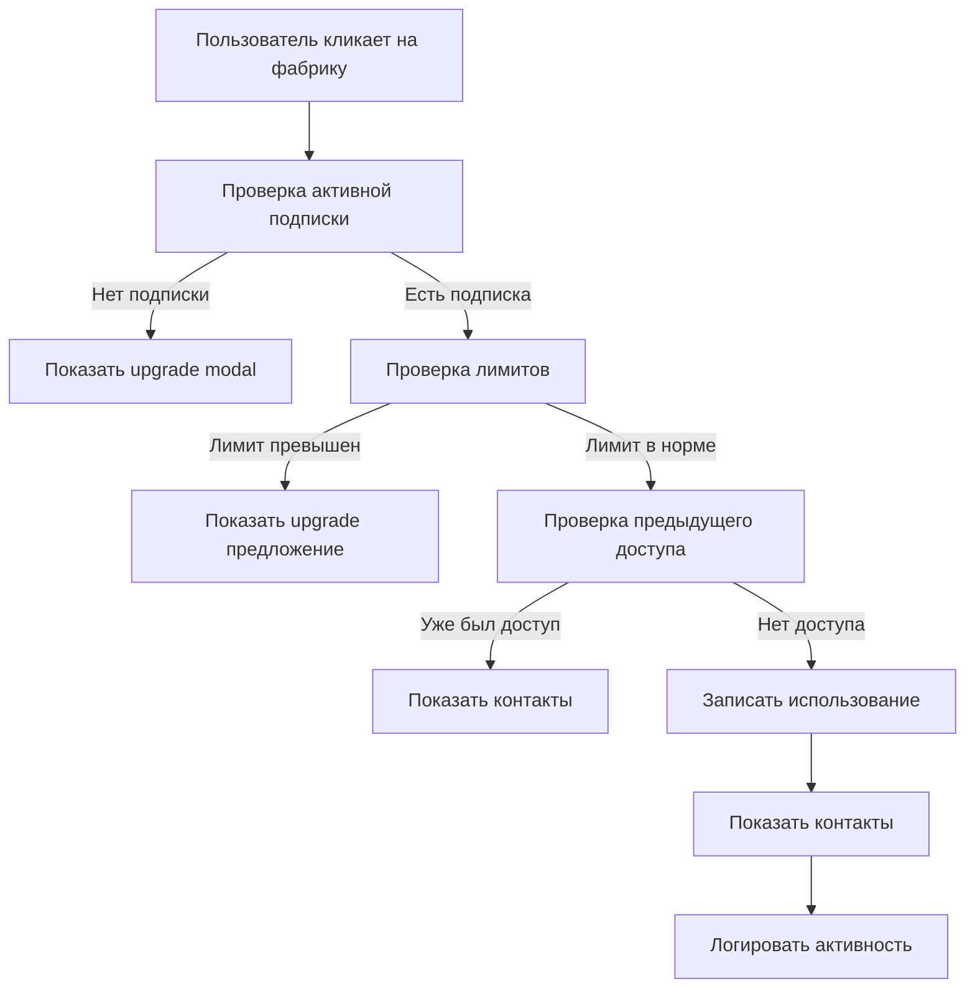
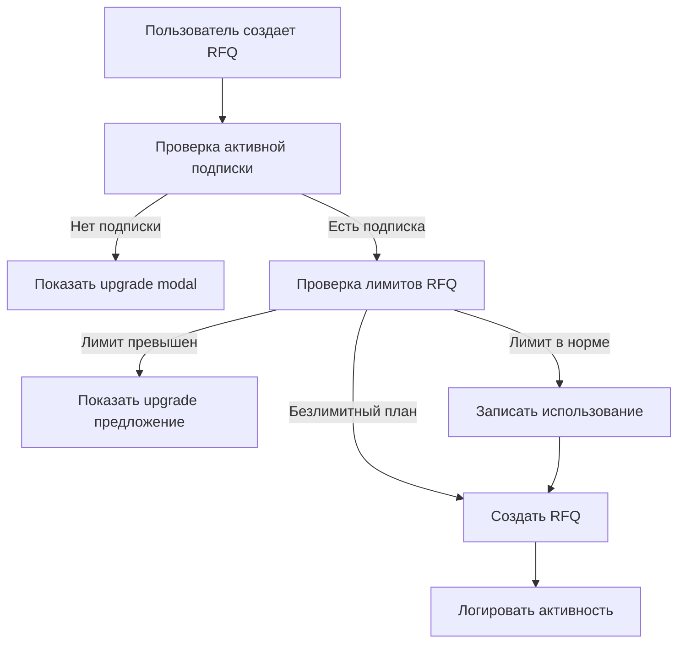

# 🚦 LIMITS SYSTEM DOCUMENTATION

## 📋 Обзор системы лимитов

Система лимитов обеспечивает контроль доступа пользователей к ресурсам на основе их тарифного плана. Система автоматически отслеживает использование, применяет ограничения и предлагает апгрейды.

## 🎯 Основные возможности

### ✅ **Контролируемые ресурсы:**
- 🏭 **Доступ к фабрикам** - просмотр контактной информации
- 📋 **Создание RFQ** - отправка запросов на производство
- 📊 **Статистика использования** - детальная аналитика
- 📈 **Рекомендации апгрейда** - умные предложения

### ✅ **Автоматические проверки:**
- 🔍 Проверка лимитов перед действием
- 🛡️ Принудительное применение ограничений
- 📝 Логирование всех действий
- 🔄 Real-time обновления

## 🏗️ Архитектура системы

### 📁 **Структура файлов:**

```
src/
├── app/api/limits/
│   ├── factory-access/route.ts    # API доступа к фабрикам
│   ├── rfq-access/route.ts        # API создания RFQ
│   └── activity/route.ts          # API активности пользователя
├── components/limits/
│   ├── LimitsChecker.tsx          # Компонент проверки лимитов
│   └── UsageStats.tsx             # Статистика использования
├── hooks/
│   └── useLimitsEnforcement.ts    # Хук принудительного применения лимитов
└── components/factory/
    └── FactoryContactProtected.tsx # Защищенные контакты фабрик
```

## 🎯 API Endpoints

### **1. POST /api/limits/factory-access**
Проверка и увеличение доступа к фабрике

**Request Body:**
```json
{
  "factory_id": "uuid"
}
```

**Response (Success):**
```json
{
  "success": true,
  "data": {
    "access_granted": true,
    "factories_used": 5,
    "factories_remaining": 5,
    "factories_limit": 10
  }
}
```

**Response (Limit Exceeded):**
```json
{
  "success": false,
  "error": "Factory access limit exceeded",
  "data": {
    "limit_exceeded": true,
    "current_plan": "starter",
    "factories_used": 10,
    "factories_limit": 10,
    "suggested_plan": "professional"
  }
}
```

### **2. GET /api/limits/factory-access?factory_id=uuid**
Получение статуса доступа к фабрике

**Response:**
```json
{
  "success": true,
  "data": {
    "has_access": true,
    "access_date": "2025-01-22T10:30:00Z",
    "factories_used": 5,
    "factories_remaining": 5,
    "factories_limit": 10,
    "plan_name": "starter"
  }
}
```

### **3. POST /api/limits/rfq-access**
Создание RFQ с проверкой лимитов

**Request Body:**
```json
{
  "rfq_data": {
    "title": "Cotton T-shirts Production",
    "description": "Need 1000 cotton t-shirts",
    "category": "apparel",
    "quantity": 1000,
    "budget_min": 5000,
    "budget_max": 8000,
    "deadline": "2025-03-01",
    "requirements": ["OEKO-TEX", "GOTS"],
    "target_countries": ["China", "Turkey"]
  }
}
```

**Response:**
```json
{
  "success": true,
  "data": {
    "rfq_id": "uuid",
    "rfq_used": 3,
    "rfq_remaining": 7,
    "rfq_limit": 10,
    "is_unlimited": false
  }
}
```

### **4. GET/POST /api/limits/activity**
Получение и логирование активности пользователя

**GET Parameters:**
- `limit` - количество записей (по умолчанию: 20)
- `offset` - смещение для пагинации
- `action` - фильтр по типу действия
- `days` - период в днях (по умолчанию: 30)

**Response:**
```json
{
  "success": true,
  "data": {
    "activities": [
      {
        "id": "uuid",
        "action": "factory_access",
        "resource_type": "factory",
        "resource_id": "factory_uuid",
        "metadata": {
          "factory_name": "Shanghai Textiles Co."
        },
        "created_at": "2025-01-22T10:30:00Z"
      }
    ],
    "stats": {
      "total_activities": 25,
      "by_action": {
        "factory_access": 15,
        "rfq_created": 10
      },
      "daily_activity": {
        "2025-01-22": 5,
        "2025-01-21": 3
      }
    }
  }
}
```

## 🎨 React Components

### **1. LimitsChecker**
Универсальный компонент для проверки лимитов перед действием

```tsx
import { LimitsChecker } from '@/components/limits/LimitsChecker';

// Проверка доступа к фабрике
<LimitsChecker
  action="factory_access"
  resourceId="factory-123"
  onSuccess={(result) => console.log('Access granted:', result)}
  onLimitExceeded={(limits) => console.log('Limit exceeded:', limits)}
  showProgress={true}
>
  <Button>Получить контакты фабрики</Button>
</LimitsChecker>

// Проверка создания RFQ
<LimitsChecker
  action="rfq_creation"
  onSuccess={() => router.push('/rfq/create')}
  onLimitExceeded={() => setShowUpgrade(true)}
>
  <Button>Создать RFQ</Button>
</LimitsChecker>
```

### **2. UsageStats**
Компонент для отображения статистики использования

```tsx
import { UsageStats } from '@/components/limits/UsageStats';

<UsageStats />
```

**Возможности:**
- 📊 Обзор лимитов по категориям
- 📈 Прогресс использования
- 📅 История активности
- 🎯 Рекомендации по апгрейду

### **3. FactoryContactProtected**
Защищенный компонент контактов фабрики

```tsx
import { FactoryContactProtected } from '@/components/factory/FactoryContactProtected';

<FactoryContactProtected
  factory={{
    id: "factory-123",
    name: "Shanghai Textiles Co.",
    contact: {
      email: "contact@shanghai-textiles.com",
      phone: "+86 21 1234 5678"
    }
  }}
  onAccessGranted={(factory) => trackEvent('factory_contact_accessed')}
  showPreview={true}
/>
```

## 🔧 React Hooks

### **useLimitsEnforcement**
Хук для принудительного применения лимитов

```tsx
import { useLimitsEnforcement } from '@/hooks/useLimitsEnforcement';

const MyComponent = () => {
  const {
    limits,
    checkFactoryAccess,
    enforceFactoryAccess,
    checkRfqCreation,
    enforceRfqCreation,
    getProcessingStatus
  } = useLimitsEnforcement();

  // Проверка лимитов
  const handleFactoryClick = async (factoryId: string) => {
    const canAccess = await checkFactoryAccess({ factoryId });
    
    if (canAccess.canProceed) {
      const result = await enforceFactoryAccess({ factoryId });
      if (result.success) {
        // Доступ получен
        showFactoryContacts(result.data);
      }
    } else {
      // Лимит превышен
      showUpgradeModal(canAccess.suggestedPlan);
    }
  };

  return (
    <div>
      <p>Фабрики: {limits?.factoriesUsed} / {limits?.factoriesLimit}</p>
      <Button 
        onClick={() => handleFactoryClick('factory-123')}
        disabled={getProcessingStatus('factory_factory-123')}
      >
        Получить доступ
      </Button>
    </div>
  );
};
```

## 📊 Лимиты по планам

### **Starter Plan (990₽/мес):**
- 🏭 **Фабрики**: 10 доступов в месяц
- 📋 **RFQ**: 5 запросов в месяц
- 📈 **Аналитика**: Базовая статистика
- ⏰ **Поддержка**: Email (48 часов)

### **Professional Plan (2990₽/мес):**
- 🏭 **Фабрики**: 50 доступов в месяц
- 📋 **RFQ**: 25 запросов в месяц
- 📈 **Аналитика**: Расширенная статистика
- ⏰ **Поддержка**: Email + Chat (24 часа)
- 🎯 **Эксклюзив**: Проверенные фабрики

### **Enterprise Plan (7990₽/мес):**
- 🏭 **Фабрики**: Безлимитный доступ
- 📋 **RFQ**: Безлимитные запросы
- 📈 **Аналитика**: Полная аналитика + API
- ⏰ **Поддержка**: Приоритетная (4 часа)
- 🎯 **Эксклюзив**: Персональный менеджер
- 💼 **Дополнительно**: Индивидуальные условия

## 🔄 Workflow системы лимитов

### **1. Проверка доступа к фабрике:**


### **2. Создание RFQ:**


## 🎯 Интеграция с PaywallGuard

Система лимитов полностью интегрирована с PaywallGuard:

```tsx
import { PaywallGuard } from '@/components/subscription/PaywallGuard';

// Защита контактов фабрики
<PaywallGuard 
  requiredPlan="starter" 
  requiredFeature="Доступ к контактам фабрик"
  variant="overlay"
>
  <FactoryContactInfo factory={factory} />
</PaywallGuard>

// Защита создания RFQ
<PaywallGuard 
  requiredPlan="professional" 
  requiredFeature="Создание RFQ запросов"
  variant="banner"
>
  <RFQCreationForm />
</PaywallGuard>
```

## 📈 Мониторинг и аналитика

### **Отслеживаемые метрики:**
- 📊 Использование лимитов по планам
- 🎯 Конверсия в апгрейды
- 📅 Активность пользователей
- 🚫 Случаи превышения лимитов
- 💰 Revenue impact от лимитов

### **Dashboards:**
- 🏭 **Фабрики**: Топ запрашиваемые фабрики
- 📋 **RFQ**: Категории и объемы запросов
- 👥 **Пользователи**: Поведенческие паттерны
- 💎 **Апгрейды**: Эффективность предложений

## 🛠️ Администрирование

### **Настройка лимитов:**
Лимиты настраиваются в таблице `subscription_plans`:

```sql
UPDATE subscription_plans 
SET 
  factory_limit = 20,  -- Новый лимит фабрик
  rfq_limit = 10       -- Новый лимит RFQ
WHERE name = 'starter';
```

### **Мониторинг использования:**
```sql
-- Топ пользователи по использованию
SELECT 
  u.email,
  ul.factories_used,
  ul.rfq_used,
  sp.name as plan_name
FROM user_limits ul
JOIN users u ON ul.user_id = u.id
JOIN subscription_plans sp ON ul.plan_id = sp.id
ORDER BY ul.factories_used DESC
LIMIT 10;

-- Статистика превышений лимитов
SELECT 
  action,
  COUNT(*) as attempts,
  DATE(created_at) as date
FROM user_activity_log 
WHERE metadata->>'limit_exceeded' = 'true'
GROUP BY action, DATE(created_at)
ORDER BY date DESC;
```

## 🚀 Production Checklist

### **Перед запуском:**
- [ ] Настроены лимиты для всех планов
- [ ] Протестированы все сценарии превышения
- [ ] Настроен мониторинг метрик
- [ ] Проверена интеграция с PaywallGuard
- [ ] Настроены уведомления об ошибках

### **Мониторинг:**
- [ ] Алерты на превышение error rate
- [ ] Мониторинг времени отклика API
- [ ] Отслеживание конверсии в апгрейды
- [ ] Анализ пользовательского поведения

## 🎉 Результат

**Полностью функциональная система лимитов:**

1. **🔒 Контроль доступа** - автоматическое применение ограничений
2. **📊 Прозрачность** - пользователи всегда знают свои лимиты
3. **💰 Монетизация** - эффективные предложения апгрейда
4. **📈 Аналитика** - детальная статистика использования
5. **🛡️ Безопасность** - защита от превышения лимитов
6. **🎯 UX** - плавные переходы и понятные сообщения

**Система готова к продакшену и масштабированию! 🚀**
